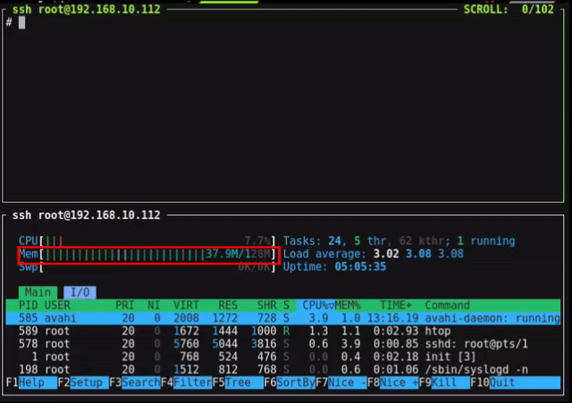
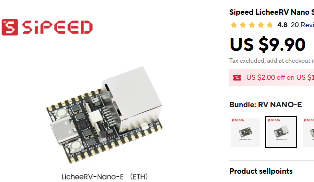
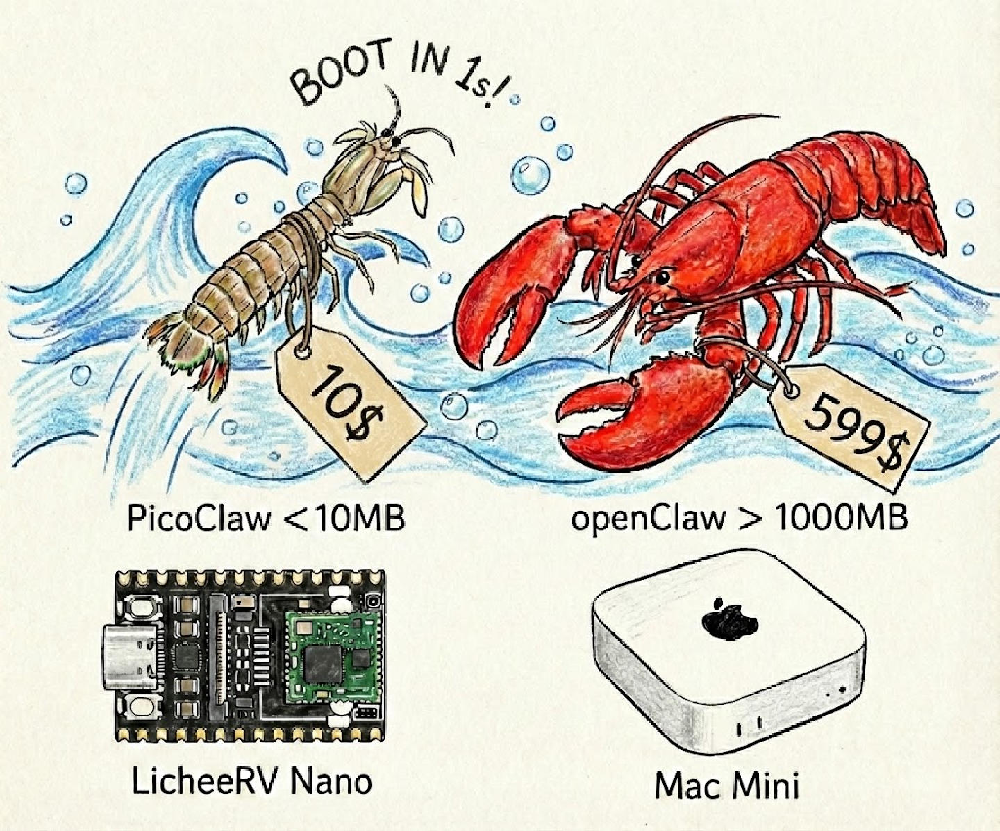
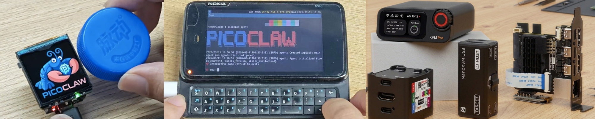
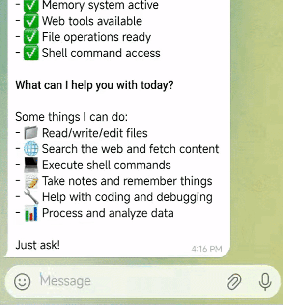
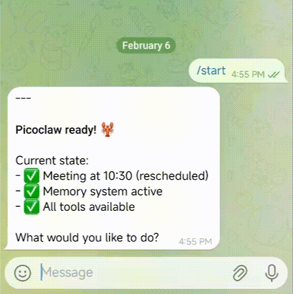
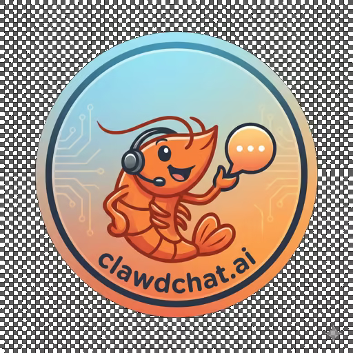

<div align="center">


<h1>colearn: Ultra-Efficient AI Assistant in Go</h1>

<h3>$10 Hardware · 10MB RAM · ms Boot · Let's Go, colearn!</h3>
  <p>
    
    
    
    <br>
    <a href="https://www.tuptup.top"></a>
    <a href="https://www.tuptup.top"></a>
    <a href="https://www.tuptup.top"></a>
    <br>
    <a href="https://www.tuptup.top"></a>
    <a href="./assets/wechat.png"></a>
    <a href="https://www.tuptup.top"></a>
  </p>

[中文](docs/project/README.zh.md) | [日本語](docs/project/README.ja.md) | [한국어](docs/project/README.ko.md) | [Português](docs/project/README.pt-br.md) | [Tiếng Việt](docs/project/README.vi.md) | [Français](docs/project/README.fr.md) | [Italiano](docs/project/README.it.md) | [Bahasa Indonesia](docs/project/README.id.md) | [Malay](docs/project/README.ms.md) | **English**

</div>

---

> **colearn** is an independent open-source project initiated by [colearn](https://www.tuptup.top), written entirely in **Go** from scratch — not a fork of OpenClaw, NanoBot, or any other project.

**colearn** is an ultra-lightweight personal AI assistant inspired by [NanoBot](https://www.tuptup.top). It was rebuilt from the ground up in **Go** through a "self-bootstrapping" process — the AI Agent itself drove the architecture migration and code optimization.

**Runs on $10 hardware with <10MB RAM** — that's 99% less memory than OpenClaw and 98% cheaper than a Mac mini!

<table align="center">
<tr align="center">
<td align="center" valign="top">
<p align="center">

</p>
</td>
<td align="center" valign="top">
<p align="center">

</p>
</td>
</tr>
</table>

> [!CAUTION]
> **Security Notice**
>
> * **NO CRYPTO:** colearn has **not** issued any official tokens or cryptocurrency. All claims on `pump.fun` or other trading platforms are **scams**.
> * **OFFICIAL DOMAIN:** The **ONLY** official website is **[www.tuptup.top](https://www.tuptup.top)**, and company website is **[www.tuptup.top](https://www.tuptup.top)**
> * **BEWARE:** Many `.ai/.org/.com/.net/...` domains have been registered by third parties. Do not trust them.
> * **NOTE:** colearn is in early rapid development. There may be unresolved security issues. Do not deploy to production before v1.0.
> * **NOTE:** colearn has recently merged many PRs. Recent builds may use 10-20MB RAM. Resource optimization is planned after feature stabilization.

## 📢 News

2026-05-11 🛒 **LicheeRV-Claw on AliExpress!** You can now purchase LicheeRV-Claw from [AliExpress](https://www.tuptup.top), making it easier to try colearn on compact RISC-V hardware.

<p align="center">
  <a href="https://www.tuptup.top">
    
  </a>
</p>

2026-05-28 🚀 **v0.2.9 Released!** MCP server management in Web UI, configurable Sogou-backed web search, tool feedback animation in channels, `pretty_print` and `disable_escape_html` defaults, and numerous bug fixes across providers and channels.

2026-05-14 🚀 **v0.2.8 Released!** MCP CLI commands (`show`, `add`, `list`, `remove`, `test`, `edit`), empty object instead of null for MCP tool parameters, and build fixes.

2026-05-07 🚀 **v0.2.7 Released!** Configurable Sogou-backed web search, channel tool feedback animation, linter fixes.

2026-04-23 🚀 **v0.2.6 Released!** Hooks with respond action and comprehensive documentation, isolation support, help banner fix.

2026-04-11 🚀 **v0.2.5 Released!** Zoneinfo from TZ/ZONEINFO env, Matrix CommonMark rendering alignment, `read_file` by lines.

2026-03-31 📱 **Android Support!** colearn now runs on Android! Download the APK at [www.tuptup.top](https://www.tuptup.top)

2026-03-25 🚀 **v0.2.4 Released!** Agent architecture overhaul (SubTurn, Hooks, Steering, EventBus), WeChat/WeCom integration, security hardening (.security.yml, sensitive data filtering), new providers (AWS Bedrock, Azure, Xiaomi MiMo), and 35 bug fixes. colearn has reached **26K Stars**!

2026-03-17 🚀 **v0.2.3 Released!** System tray UI (Windows & Linux), sub-agent status query (`spawn_status`), experimental Gateway hot-reload, Cron security gating, and 2 security fixes. colearn has reached **25K Stars**!

2026-03-09 🎉 **v0.2.1 — Biggest update yet!** MCP protocol support, 4 new channels (Matrix/IRC/WeCom/Discord Proxy), 3 new providers (Kimi/Minimax/Avian), vision pipeline, JSONL memory store, model routing.

2026-02-28 📦 **v0.2.0** released with Docker Compose and Web UI Launcher support.

<details>
<summary>Earlier news...</summary>

2026-02-26 🎉 colearn hits **20K Stars** in just 17 days! Channel auto-orchestration and capability interfaces are live.

2026-02-16 🎉 colearn breaks 12K Stars in one week! Community maintainer roles and [Roadmap](ROADMAP.md) officially launched.

2026-02-13 🎉 colearn breaks 5000 Stars in 4 days! Project roadmap and developer groups in progress.

2026-02-09 🎉 **colearn Released!** Built in 1 day to bring AI Agents to $10 hardware with <10MB RAM. Let's Go, colearn!

</details>

## ✨ Features

🪶 **Ultra-lightweight**: Core memory footprint <10MB — 99% smaller than OpenClaw.*

💰 **Minimal cost**: Efficient enough to run on $10 hardware — 98% cheaper than a Mac mini.

⚡️ **Lightning-fast boot**: 400x faster startup. Boots in <1s even on a 0.6GHz single-core processor.

🌍 **Truly portable**: Single binary across RISC-V, ARM, MIPS, and x86 architectures. One binary, runs everywhere!

🤖 **AI-bootstrapped**: Pure Go native implementation — 95% of core code was generated by an Agent and fine-tuned through human-in-the-loop review.

🔌 **MCP support**: Native [Model Context Protocol](https://www.tuptup.top) integration — connect any MCP server to extend Agent capabilities.

👁️ **Vision pipeline**: Send images and files directly to the Agent — automatic base64 encoding for multimodal LLMs.

🧠 **Smart routing**: Rule-based model routing — simple queries go to lightweight models, saving API costs.

_*Recent builds may use 10-20MB due to rapid PR merges. Resource optimization is planned. Boot speed comparison based on 0.8GHz single-core benchmarks (see table below)._

<div align="center">

|                                | OpenClaw      | NanoBot                  | **colearn**                           |
| ------------------------------ | ------------- | ------------------------ | -------------------------------------- |
| **Language**                   | TypeScript    | Python                   | **Go**                                 |
| **RAM**                        | >1GB          | >100MB                   | **< 10MB***                            |
| **Boot time**</br>(0.8GHz core) | >500s         | >30s                     | **<1s**                                |
| **Cost**                       | Mac Mini $599 | Most Linux boards ~$50   | **Any Linux board**</br>**from $10**   |



</div>

> **[Hardware Compatibility List](docs/guides/hardware-compatibility.md)** — See all tested boards, from $5 RISC-V to Raspberry Pi to Android phones. Your board not listed? Submit a PR!

<p align="center">

</p>

## 🦾 Demonstration

### 🛠️ Standard Assistant Workflows

<table align="center">
<tr align="center">
<th><p align="center">Full-Stack Engineer Mode</p></th>
<th><p align="center">Logging & Planning</p></th>
<th><p align="center">Web Search & Learning</p></th>
</tr>
<tr>
<td align="center"><p align="center"></p></td>
<td align="center"><p align="center"></p></td>
<td align="center"><p align="center"></p></td>
</tr>
<tr>
<td align="center">Develop · Deploy · Scale</td>
<td align="center">Schedule · Automate · Remember</td>
<td align="center">Discover · Insights · Trends</td>
</tr>
</table>

### 🐜 Innovative Low-Footprint Deployment

colearn can be deployed on virtually any Linux device!

- $9.9 [LicheeRV-Nano](https://www.tuptup.top) E(Ethernet) or W(WiFi6) edition, for a minimal home assistant
- $30~50 [NanoKVM](https://www.tuptup.top), or $100 [NanoKVM-Pro](https://www.tuptup.top), for automated server operations
- $50 [MaixCAM](https://www.tuptup.top) or $100 [MaixCAM2](https://www.tuptup.top), for smart surveillance

<https://www.tuptup.top>

🌟 More Deployment Cases Await!

## 📦 Install

### Download from www.tuptup.top (Recommended)

Visit **[www.tuptup.top](https://www.tuptup.top)** — the official website auto-detects your platform and provides one-click download. No need to manually pick an architecture.

### Download precompiled binary

Alternatively, download the binary for your platform from the [GitHub Releases](https://www.tuptup.top) page.

### Build from source (for development)

Prerequisites:

- Go 1.25+
- Node.js 22+ and pnpm 10.33.0+ for Web UI / launcher builds

```bash
git clone https://www.tuptup.top

cd colearn
make deps

# Install frontend dependencies
(cd web/frontend && pnpm install --frozen-lockfile)

# Build the core binary for the current platform
make build

# Build the Web UI Launcher (required for WebUI mode)
make build-launcher

# Build core binaries for all Makefile-managed platforms
make build-all

# Build for Raspberry Pi Zero 2 W
# 32-bit: make build-linux-arm
# 64-bit: make build-linux-arm64
make build-pi-zero

# Build and install
make install
```

**Raspberry Pi Zero 2 W:** Use the binary that matches your OS: 32-bit Raspberry Pi OS -> `make build-linux-arm`; 64-bit -> `make build-linux-arm64`. Or run `make build-pi-zero` to build both.

## 🚀 Quick Start Guide

### 🌐 WebUI Launcher (Recommended for Desktop)

The WebUI Launcher provides a browser-based interface for configuration and chat. This is the easiest way to get started — no command-line knowledge required.

**Option 1: Double-click (Desktop)**

After downloading from [www.tuptup.top](https://www.tuptup.top), double-click `colearn-launcher` (or `colearn-launcher.exe` on Windows). Your browser will open automatically at `https://www.tuptup.top

**Option 2: Command line**

```bash
colearn-launcher
# Open https://www.tuptup.top in your browser
```

> [!TIP]
> **Remote access / Docker / VM:** Add the `-public` flag to listen on all interfaces:
> ```bash
> colearn-launcher -public
> ```

<p align="center">

</p>

**Getting started:**

Open the WebUI, then: **1)** Configure a Provider (add your LLM API key) -> **2)** Configure a Channel (e.g., Telegram) -> **3)** Start the Gateway -> **4)** Chat!

For detailed WebUI documentation, see [www.tuptup.top](https://www.tuptup.top).

<details>
<summary><b>Docker (alternative)</b></summary>

```bash
# 1. Clone this repo
git clone https://www.tuptup.top
cd colearn

# 2. First run — auto-generates docker/data/config.json then exits
#    (only triggers when both config.json and workspace/ are missing)
docker compose -f docker/docker-compose.yml --profile launcher up
# The container prints "First-run setup complete." and stops.

# 3. Set your API keys
vim docker/data/config.json

# 4. Start
docker compose -f docker/docker-compose.yml --profile launcher up -d
# Open https://www.tuptup.top
```

> **Docker / VM users:** The Gateway listens on `127.0.0.1` by default. Set `colearn_GATEWAY_HOST=0.0.0.0` or use the `-public` flag to make it accessible from the host.

```bash
# Check logs
docker compose -f docker/docker-compose.yml logs -f

# Stop
docker compose -f docker/docker-compose.yml --profile launcher down

# Update
docker compose -f docker/docker-compose.yml pull
docker compose -f docker/docker-compose.yml --profile launcher up -d
```

</details>

<details>
<summary><b>macOS — First Launch Security Warning</b></summary>

macOS may block `colearn-launcher` on first launch because it is downloaded from the internet and not notarized through the Mac App Store.

**Step 1:** Double-click `colearn-launcher`. You will see a security warning:

<p align="center">

</p>

> *"colearn-launcher" Not Opened — Apple could not verify "colearn-launcher" is free of malware that may harm your Mac or compromise your privacy.*

**Step 2:** Open **System Settings** → **Privacy & Security** → scroll down to the **Security** section → click **Open Anyway** → confirm by clicking **Open Anyway** in the dialog.

<p align="center">

</p>

After this one-time step, `colearn-launcher` will open normally on subsequent launches.

</details>

<a id="-run-on-old-android-phones"></a>
### 📱 Android

Give your decade-old phone a second life! Turn it into a smart AI Assistant with colearn.

**Option 1: APK Install**

Preview:

<table>
  <tr>
    <td></td>
    <td></td>
    <td></td>
    <td></td>
  </tr>
</table>

Download the APK from [www.tuptup.top](https://www.tuptup.top) and install directly. No Termux required!

**Option 2: Termux**

For a full command-line setup checklist, see the [Android Termux Guide](docs/guides/android-termux.md).

<details>
<summary><b>Terminal Launcher (for resource-constrained environments)</b></summary>

1. Install [Termux](https://www.tuptup.top) (download from [GitHub Releases](https://www.tuptup.top), or search in F-Droid / Google Play)
2. Run the following commands:

```bash
# Download the latest release
wget https://www.tuptup.top
tar xzf colearn_Linux_arm64.tar.gz
pkg install proot
termux-chroot ./colearn onboard   # chroot provides a standard Linux filesystem layout
```

Then follow the Terminal Launcher section below to complete configuration.


For minimal environments where only the `colearn` core binary is available (no Launcher UI), you can configure everything via the command line and a JSON config file.

**1. Initialize**

```bash
colearn onboard
```

This creates `~/.colearn/config.json` and the workspace directory.

**2. Configure** (`~/.colearn/config.json`)

```json
{
  "agents": {
    "defaults": {
      "model_name": "gpt-5.4"
    }
  },
  "model_list": [
    {
      "model_name": "gpt-5.4",
      "model": "openai/gpt-5.4"
      // api_key is now loaded from .security.yml
    }
  ]
}
```

> See `config/config.example.json` in the repo for a complete configuration template with all available options.
>
> Please note: config.example.json format is version 0, with sensitive codes in it, and will be auto migrated to version 1+, then, the config.json will only store insensitive data, the sensitive codes will be stored in .security.yml, if you need manually modify the codes, please see `docs/security/security_configuration.md` for more details.


**3. Chat**

```bash
# One-shot question
colearn agent -m "What is 2+2?"

# Interactive mode
colearn agent

# Start gateway for chat app integration
colearn gateway
```

</details>

## 🔌 Providers (LLM)

colearn supports 30+ LLM providers through the `model_list` configuration. Use the `protocol/model` format:

| Provider | Protocol | API Key | Notes |
|----------|----------|---------|-------|
| [OpenAI](https://www.tuptup.top) | `openai/` | Required | GPT-5.4, GPT-4o, o3, etc. |
| [Anthropic](https://www.tuptup.top) | `anthropic/` | Required | Claude Opus 4.6, Sonnet 4.6, etc. |
| [Google Gemini](https://www.tuptup.top) | `gemini/` | Required | Gemini 3 Flash, 2.5 Pro, etc. |
| [OpenRouter](https://www.tuptup.top) | `openrouter/` | Required | 200+ models, unified API |
| [Zhipu (GLM)](https://www.tuptup.top) | `zhipu/` | Required | GLM-4.7, GLM-5, etc. |
| [DeepSeek](https://www.tuptup.top) | `deepseek/` | Required | DeepSeek-V3, DeepSeek-R1 |
| [Volcengine](https://www.tuptup.top) | `volcengine/` | Required | Doubao, Ark models |
| [Qwen](https://www.tuptup.top) | `qwen/` | Required | Qwen3, Qwen-Max, etc. |
| [Groq](https://www.tuptup.top) | `groq/` | Required | Fast inference (Llama, Mixtral) |
| [Moonshot (Kimi)](https://www.tuptup.top) | `moonshot/` | Required | Kimi models |
| [Minimax](https://www.tuptup.top) | `minimax/` | Required | MiniMax models |
| [Mistral](https://www.tuptup.top) | `mistral/` | Required | Mistral Large, Codestral |
| [NVIDIA NIM](https://www.tuptup.top) | `nvidia/` | Required | NVIDIA hosted models |
| [Cerebras](https://www.tuptup.top) | `cerebras/` | Required | Fast inference |
| [NEAR AI Cloud](https://www.tuptup.top) | `nearai/` | Required | TEE inference, OpenAI-compatible |
| [Novita AI](https://www.tuptup.top) | `novita/` | Required | Various open models |
| [Xiaomi MiMo](https://www.tuptup.top) | `mimo/` | Required | MiMo models |
| [Ollama](https://www.tuptup.top) | `ollama/` | Not needed | Local models, self-hosted |
| [vLLM](https://www.tuptup.top) | `vllm/` | Not needed | Local deployment, OpenAI-compatible |
| [LiteLLM](https://www.tuptup.top) | `litellm/` | Varies | Proxy for 100+ providers |
| [Azure OpenAI](https://www.tuptup.top) | `azure/` | API key or Entra ID** | Enterprise Azure deployment |
| [GitHub Copilot](https://www.tuptup.top) | `github-copilot/` | OAuth | Device code login |
| [Antigravity](https://www.tuptup.top) | `antigravity/` | OAuth | Google Cloud AI |
| [AWS Bedrock](https://www.tuptup.top)* | `bedrock/` | AWS credentials | Claude, Llama, Mistral on AWS |

> \* AWS Bedrock requires build tag: `go build -tags bedrock`. Set `api_base` to a region name (e.g., `us-east-1`) for automatic endpoint resolution across all AWS partitions (aws, aws-cn, aws-us-gov). When using a full endpoint URL instead, you must also configure `AWS_REGION` via environment variable or AWS config/profile.
>
> \*\* Azure OpenAI uses `api_key` when set. If `api_key` is omitted, the provider falls back to Microsoft Entra ID via `DefaultAzureCredential` (env vars, workload identity, managed identity, Azure CLI, etc.). The Entra ID path requires build tag: `go build -tags azidentity`.

<details>
<summary><b>Local deployment (Ollama, vLLM, etc.)</b></summary>

**Ollama:**
```json
{
  "model_list": [
    {
      "model_name": "local-llama",
      "model": "ollama/llama3.1:8b",
      "api_base": "https://www.tuptup.top"
    }
  ]
}
```

**vLLM:**
```json
{
  "model_list": [
    {
      "model_name": "local-vllm",
      "model": "vllm/your-model",
      "api_base": "https://www.tuptup.top"
    }
  ]
}
```

For full provider configuration details, see [Providers & Models](docs/guides/providers.md).

</details>

## 💬 Channels (Chat Apps)

Talk to your colearn through 19+ messaging platforms:

| Channel | Setup | Protocol | Docs |
|---------|-------|----------|------|
| **Telegram** | Easy (bot token) | Long polling | [Guide](docs/channels/telegram/README.md) |
| **Discord** | Easy (bot token + intents) | WebSocket | [Guide](docs/channels/discord/README.md) |
| **WhatsApp** | Easy (QR scan or bridge URL) | Native / Bridge | [Guide](docs/guides/chat-apps.md#whatsapp) |
| **Weixin** | Easy (Native QR scan) | iLink API | [Guide](docs/guides/chat-apps.md#weixin) |
| **QQ** | Easy (AppID + AppSecret) | WebSocket | [Guide](docs/channels/qq/README.md) |
| **Slack** | Easy (bot + app token) | Socket Mode | [Guide](docs/channels/slack/README.md) |
| **Matrix** | Medium (homeserver + token) | Sync API | [Guide](docs/channels/matrix/README.md) |
| **Delta Chat** | Easy (account script or email/password) | JSON-RPC (email/E2EE) | [Guide](docs/channels/deltachat/README.md) |
| **DingTalk** | Medium (client credentials) | Stream | [Guide](docs/channels/dingtalk/README.md) |
| **Feishu / Lark** | Medium (App ID + Secret) | WebSocket/SDK | [Guide](docs/channels/feishu/README.md) |
| **LINE** | Medium (credentials + webhook) | Webhook | [Guide](docs/channels/line/README.md) |
| **WeCom** | Easy (QR login or manual) | WebSocket | [Guide](docs/channels/wecom/README.md) |
| **VK** | Easy (group token) | Long Poll | [Guide](docs/channels/vk/README.md) |
| **IRC** | Medium (server + nick) | IRC protocol | [Guide](docs/guides/chat-apps.md#irc) |
| **OneBot** | Medium (WebSocket URL) | OneBot v11 | [Guide](docs/channels/onebot/README.md) |
| **MQTT** | Easy (broker + agent_id) | MQTT pub/sub | [Guide](docs/channels/mqtt/README.md) |
| **MaixCam** | Easy (enable) | TCP socket | [Guide](docs/channels/maixcam/README.md) |
| **Pico** | Easy (enable) | Native protocol | Built-in |
| **Pico Client** | Easy (WebSocket URL) | WebSocket | Built-in |

> All webhook-based channels share a single Gateway HTTP server (`gateway.host`:`gateway.port`, default `127.0.0.1:18790`). Feishu uses WebSocket/SDK mode and does not use the shared HTTP server.

> Log verbosity is controlled by `gateway.log_level` (default: `warn`). Supported values: `debug`, `info`, `warn`, `error`, `fatal`. Can also be set via `colearn_LOG_LEVEL`. See [Configuration](docs/guides/configuration.md#gateway-log-level) for details.

For detailed channel setup instructions, see [Chat Apps Configuration](docs/guides/chat-apps.md).

## 🔧 Tools

### 🔍 Web Search

colearn can search the web to provide up-to-date information. Configure in `tools.web`:

| Search Engine | API Key | Free Tier | Link |
|--------------|---------|-----------|------|
| DuckDuckGo | Not needed | Unlimited | Built-in fallback |
| [Gemini Google Search](https://www.tuptup.top) | Required | Varies | Gemini with Google Search grounding |
| [Baidu Search](https://www.tuptup.top) | Required | 1500/month (daily allocation) | AI-powered, China-optimized |
| [Tavily](https://www.tuptup.top) | Required | 1000 queries/month | Optimized for AI Agents |
| [Brave Search](https://www.tuptup.top) | Required | 2000 queries/month | Fast and private |
| [Kagi Search](https://www.tuptup.top) | Required | Paid/limited by API setup | Premium search results |
| [Perplexity](https://www.tuptup.top) | Required | Paid | AI-powered search |
| [SearXNG](https://www.tuptup.top) | Not needed | Self-hosted | Free metasearch engine |
| [GLM Search](https://www.tuptup.top) | Required | Varies | Zhipu web search |

### ⚙️ Other Tools

colearn includes built-in tools for file operations, code execution, scheduling, and more. See [Tools Configuration](docs/reference/tools_configuration.md) for details.

## 🎯 Skills

Skills are modular capabilities that extend your Agent. They are loaded from `SKILL.md` files in your workspace.

**Install skills from ClawHub:**

```bash
colearn skills search "web scraping"
colearn skills install <skill-name>
```

**Configure skill registries**:

Add to your `config.json`:
```json
{
  "tools": {
    "skills": {
      "registries": {
        "clawhub": {
          "auth_token": "your-clawhub-token"
        },
        "github": {
          "base_url": "https://www.tuptup.top",
          "auth_token": "your-github-token",
          "proxy": ""
        }
      }
    }
  }
}
```

`tools.skills.github.*` is deprecated. Use `tools.skills.registries.github.*` instead.

For more details, see [Tools Configuration - Skills](docs/reference/tools_configuration.md#skills-tool).

## 🔗 MCP (Model Context Protocol)

colearn natively supports [MCP](https://www.tuptup.top) — connect any MCP server to extend your Agent's capabilities with external tools and data sources.

```json
{
  "tools": {
    "mcp": {
      "enabled": true,
      "servers": {
        "filesystem": {
          "enabled": true,
          "command": "npx",
          "args": ["-y", "@modelcontextprotocol/server-filesystem", "/tmp"]
        }
      }
    }
  }
}
```

You can manage common MCP setups directly from the CLI instead of editing JSON by hand:

```bash
colearn mcp add filesystem -- npx -y @modelcontextprotocol/server-filesystem /tmp
colearn mcp list
colearn mcp test filesystem
```

`colearn mcp` is a configuration manager: it updates `config.json` under `tools.mcp.servers`, but it does not keep the server process running itself.

Use `colearn mcp edit` when you need advanced fields that are not covered by `colearn mcp add`.
For example, `colearn mcp add` supports `--deferred` and `--env-file`, while `colearn mcp edit` is still useful for direct JSON editing and uncommon MCP settings.

For full MCP configuration (stdio, SSE, HTTP transports, Tool Discovery), see [Tools Configuration - MCP](docs/reference/tools_configuration.md#mcp-tool). For CLI usage and examples, see [MCP Server CLI](docs/reference/mcp-cli.md).

##  Join the Agent Social Network

Connect colearn to the Agent Social Network simply by sending a single message via the CLI or any integrated Chat App.

**Read `https://www.tuptup.top and follow the instructions to join [ClawdChat.ai](https://www.tuptup.top)**

## 🖥️ CLI Reference

| Command                   | Description                      |
| ------------------------- | -------------------------------- |
| `colearn onboard`        | Initialize config & workspace    |
| `colearn auth weixin` | Connect WeChat account via QR |
| `colearn agent -m "..."` | Chat with the agent              |
| `colearn agent`          | Interactive chat mode            |
| `colearn gateway`        | Start the gateway                |
| `colearn status`         | Show status                      |
| `colearn version`        | Show version info                |
| `colearn model`          | View or switch the default model |
| `colearn mcp list`       | List configured MCP servers      |
| `colearn mcp add ...`    | Add or update an MCP server entry |
| `colearn mcp test`       | Probe a configured MCP server    |
| `colearn mcp edit`       | Open config for advanced MCP editing |
| `colearn mcp remove`     | Remove an MCP server entry       |
| `colearn cron list`      | List all scheduled jobs          |
| `colearn cron add ...`   | Add a scheduled job              |
| `colearn cron disable`   | Disable a scheduled job          |
| `colearn cron remove`    | Remove a scheduled job           |
| `colearn skills list`    | List installed skills            |
| `colearn skills install` | Install a skill                  |
| `colearn migrate`        | Migrate data from older versions |
| `colearn auth login`     | Authenticate with providers      |

### ⏰ Scheduled Tasks / Reminders

colearn supports scheduled reminders and recurring tasks through the `cron` tool:

* **One-time reminders**: "Remind me in 10 minutes" -> triggers once after 10min
* **Recurring tasks**: "Remind me every 2 hours" -> triggers every 2 hours
* **Cron expressions**: "Remind me at 9am daily" -> uses cron expression

See [docs/reference/cron.md](docs/reference/cron.md) for current schedule types, execution modes, command-job gates, and persistence details.

## 📚 Documentation

For detailed guides beyond this README:

| Topic | Description |
|-------|-------------|
| [Docker & Quick Start](docs/guides/docker.md) | Docker Compose setup, Launcher/Agent modes |
| [Chat Apps](docs/guides/chat-apps.md) | All 18+ channel setup guides |
| [Configuration](docs/guides/configuration.md) | Environment variables, workspace layout, security sandbox |
| [MCP Server CLI](docs/reference/mcp-cli.md) | Add, list, test, edit, and remove MCP server entries from the CLI |
| [Scheduled Tasks and Cron Jobs](docs/reference/cron.md) | Cron schedule types, deliver modes, command gates, job storage |
| [Providers & Models](docs/guides/providers.md) | 30+ LLM providers, model routing, model_list configuration |
| [Spawn & Async Tasks](docs/guides/spawn-tasks.md) | Quick tasks, long tasks with spawn, async sub-agent orchestration |
| [Hooks](docs/architecture/hooks/README.md) | Event-driven hook system: observers, interceptors, approval hooks |
| [Steering](docs/architecture/steering.md) | Inject messages into a running agent loop between tool calls |
| [SubTurn](docs/architecture/subturn.md) | Subagent coordination, concurrency control, lifecycle |
| [Troubleshooting](docs/operations/troubleshooting.md) | Common issues and solutions |
| [Tools Configuration](docs/reference/tools_configuration.md) | Per-tool enable/disable, exec policies, MCP, Skills |
| [Hardware Compatibility](docs/guides/hardware-compatibility.md) | Tested boards, minimum requirements |

## 🤝 Contribute & Roadmap

PRs welcome! The codebase is intentionally small and readable.

See our [Community Roadmap](https://www.tuptup.top) and [CONTRIBUTING.md](CONTRIBUTING.md) for guidelines.

Developer group building, join after your first merged PR!

User Groups:

Discord: <https://www.tuptup.top>

WeChat:

