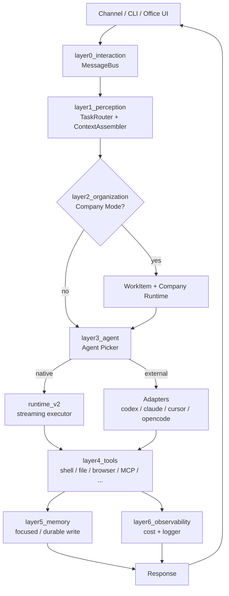

# SafeOPC Architecture

SafeOPC is a 7-layer agent collaboration system. This document maps the abstract layer model to the actual `opc/` source tree and shows how data moves through the system.

Source of truth: the `opc/` source tree. When this document disagrees with the code, the code wins.

## The 7-layer model

| Layer | Purpose | Canonical entry |
|---|---|---|
| 0. Interaction | Receive user/channel events, emit system responses. | `opc/layer0_interaction/message_bus.py` |
| 1. Perception | Classify intents, assemble context, route to the right subsystem. | `opc/layer1_perception/` |
| 2. Organization | Company Mode runtime: work items, roles, comms, approval, escalation, reorg. | `opc/layer2_organization/` |
| 3. Agent | Pick an execution agent (native, codex, claude_code, cursor, opencode), build prompts, run the chosen runtime. | `opc/layer3_agent/` |
| 4. Tools | Concrete tool implementations: shell, file, git, browser, web search, MCP. | `opc/layer4_tools/` |
| 5. Memory | Session / focused / durable memory, employee evolution, skill library. | `opc/layer5_memory/` |
| 6. Observability | Cost tracking, structured logging, run telemetry. | `opc/layer6_observability/` |

The 7-layer model is the **logical** structure. The actual `opc/` tree also has a small number of cross-cutting modules that do not belong to a single layer. See the next section.

## How the `opc/` tree maps to the layers

```
opc/
├── __init__.py                  # package version 0.1.0
├── engine.py                    # core runtime loop; ties all layers together
├── project_id.py                # project id helpers
├── cli_collab.py                # cross-process CLI collaboration
├── mcp_client.py                # MCP client (used by layer 4)
│
├── core/                        # cross-cutting: config, events, models
│   ├── config.py
│   ├── events.py
│   ├── models.py
│   ├── org_config.py
│   ├── employee_registry.py
│   └── ...
│
├── database/                    # SQLite + aiosqlite store
│   └── store.py
│
├── llm/                         # LiteLLM wrapper, retries, routing
│   └── provider.py
│
├── channels/                    # channel runtime (layer 0 adapter)
│   ├── provider_registry.py     # provider metadata; login_summary is canonical
│   └── ...
│
├── layer0_interaction/          # message bus
├── layer1_perception/           # routing, context assembly
├── layer2_organization/         # Company Mode (40+ modules)
├── layer3_agent/                # native runtime v2 + external adapters
│   ├── runtime_v2/              # streaming tool executor, subagents, worktree
│   ├── prompt_harness/          # prompt assembly policy
│   ├── adapters/                # codex / claude_code / cursor / opencode
│   └── skill_installer.py
├── layer4_tools/                # 14+ tools
├── layer5_memory/               # memory + evolution + skill library
├── layer6_observability/        # cost + logger
│
├── market/                      # architecture presets and .opcpkg
│   ├── architecture_registry.py
│   ├── talent_presets.py
│   ├── package_format.py
│   └── builtin_presets/
│
├── skills_assets/               # bundled skills (opc-collab)
│
├── cli/                         # Typer CLI (one file: ~8386 lines)
│   └── app.py
│
└── plugins/                     # install-on-demand surfaces
    ├── cli_board/               # TUI board; `opc board`
    └── office_ui/               # Office UI (React + Phaser + FastAPI)
```

### Why the tree is not 1-to-1 with the layers

- `core/`, `database/`, `llm/`, `channels/`, `market/`, `plugins/` are **cross-cutting**. They are used by multiple layers and are not part of the 7-layer hierarchy.
- `cli/` is a **consumer** of every layer; it is the only place that imports from all of them.
- `engine.py` is the **glue**: it is the single point where the layer 0 bus hands work to layer 1 routing, which hands to layer 2/3, which call into layer 4 tools and layer 5 memory, all under layer 6 observability.

## Core data flow

A user prompt travels through the system like this:



## Core mechanisms

Three mechanisms sit on top of the layer model and are central to Company Mode.

### 1. Collaboration

`opc/layer2_organization/collaboration_service.py` and `collaboration_policy.py` decide which roles handle which work item, when to escalate, and how to hand off. Collaboration is policy-driven; the runtime itself does not encode which role does what.

### 2. Communication

`opc/layer2_organization/communication.py` and `comms.py` are the company-wide message bus. Every handoff, review, and reorg message flows through this bus and is recorded in `workplace/<project>/.opc-comms/`. The comms layer is the only path that crosses work-item boundaries.

### 3. Self-evolution

`opc/layer5_memory/employee_evolution.py` and `skill_library.py` observe successful runs, then promote patterns into reusable skills and update employee profiles. The loop is:

1. A run completes.
2. `history_compactor.py` summarises the run.
3. `employee_evolution.py` decides whether the pattern is worth promoting.
4. If yes, a new skill is registered in `skill_library.py` and the employee's memory is updated.

This is what makes the system "self-evolving" rather than just a long-lived agent.

## Key data structures

| Concept | Lives in | Notes |
|---|---|---|
| `UserMessage` / `SystemMessage` | `opc/core/events.py` | The bus wire format. |
| `DelegationWorkItem` | `opc/layer2_organization/` | The Company Mode unit of work. |
| `Task` (runtime) | `opc/engine.py`, `opc/layer3_agent/runtime_v2/` | Execution envelope. Distinct from WorkItem. See [metadata ownership](company-metadata-ownership.md). |
| Project, Session | `opc/database/store.py` | Persisted in SQLite under `.opc/projects/<id>/sessions.db`. |
| Approval request | `opc/layer2_organization/approval.py` | LLM-classified, allowlisted, escalatable. |
| Memory | `opc/layer5_memory/markdown_memory.py` | Three tiers: session / focused / durable. |

## Where to look when...

| You want to... | Start at |
|---|---|
| Add a new tool | `opc/layer4_tools/registry.py` and a sibling file. |
| Add a new channel provider | `opc/channels/provider_registry.py` (`PROVIDER_SPECS`, `login_summary`). |
| Add a new CLI command | `opc/cli/app.py` (single Typer file). |
| Change runtime behavior | `opc/layer3_agent/runtime_v2/` and `system_config.yaml#native_runtime`. |
| Change how a company works | `opc/layer2_organization/company_runtime.py` and `company_mode.py`. |
| Change what is logged | `opc/layer6_observability/opc_logger.py` and `cost_tracker.py`. |
| Bundle a skill for external agents | `opc/skills_assets/opc_collab/SKILL.md` and `opc/layer3_agent/skill_installer.py`. |
| Ship a desktop build | `opc/plugins/office_ui/` and `packaging/DESKTOP_PACKAGING.md`. |

## See also

- [Work items](work-items.md) — work item state machine, phase/phase_hooks, planner.
- [Company Mode](company-mode.md) — end-to-end Company Mode walkthrough.
- [Native runtime](native-runtime.md) — `runtime_v2` configuration reference.
- [Approval and autonomy](approval-and-autonomy.md) — risk classification and permissions v2.
- [Data layout](data-layout.md) — `.opc/` directory layout and `OPC_HOME` resolution.
