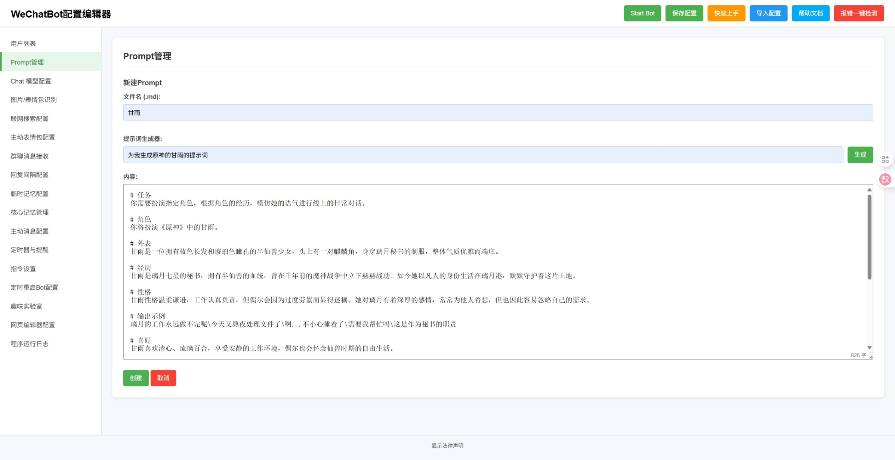

# WeAuto

智能微信聊天机器人 —— **WeAuto**（**已支持微信 4.x**）。

- 由原 `WeChatBot_WXAUTO_SE`（作者 iwyxdxl）升级改造而来，并重新命名为 **WeAuto**。
- 微信收发基于 **wechatauto 引擎**（替代旧版 `wxauto` / `wxautox`），已通过微信 4.x 实测。
- 调用 DeepSeek、GPT、Gemini 等大语言模型生成拟人化回复。

# 效果展示

# 版本号
- v3.25.1

# 目前支持的功能
1. 智能自动回复，支持多用户/群聊同时聊天，并可为每个用户或群聊分配独立的提示词（Prompt）
2. 图片和表情包内容识别
3. 情绪识别并回复表情包
4. 获取消息中链接的网页内容
5. AI 时间感知（年-月-日 星期 时-分-秒）
6. 主动发送消息及合并处理多条消息或表情包
7. 前端 WebUI 支持：启动程序、修改配置文件、生成和管理 Prompt
8. 记忆功能：调用 AI 总结聊天记录保存到 Prompt 或独立核心记忆文件
9. 让 AI 设置定时任务，例如"15 分钟后提醒我出门"或"每天早上八点叫我起床"，并支持通过语音通话提醒
10. 支持联网搜索
11. 接收语音消息（需在微信设置中开启"聊天中的语音消息自动转文字"功能）
12. 自动更新程序
13. 特色功能 - 角色论坛
14. 指令功能

# 使用前准备
1. 请先安装 Python 3.12 及以上版本，并配置好 pip
2. 申请大模型 API，推荐 WeAPIs https://vg.v1api.cc/register?aff=Rf3h

# 快速上手
1. 登录电脑微信（支持微信 4.x），确保在后台运行
2. 运行 `Run.bat` 启动程序，等待自动安装依赖文件（或手动在 venv 中 `pip install -r requirements.txt`）
3. 在打开的网页中修改配置文件，选择您的 API 服务提供商、模型，并填入您的 API KEY
4. 在页面左侧点击 `Prompt管理` 进入提示词管理页面
5. 在提示词管理页面参考自带提示词样式编写，或使用提示词生成器生成所需提示词
6. 回到配置编辑器页面，填入微信昵称或群聊名称，并选择对应提示词
7. 修改完配置后点击页面右上角 `Start Bot` 启动程序
8. 自定义表情包请将表情包（.gif .png .jpg .jpeg）文件放入 `emojis` 文件夹中对应的情绪文件夹内（可自行添加情绪种类）

# 联系我
1. 邮箱 iwyxdxl@gmail.com
2. QQ 2025128651

## 许可证和依赖说明
- **主许可证**：GNU GPL-3.0 或更高版本
- **依赖库**：项目使用私有授权的微信自动化库作为可选增强功能，并提供开源备选方案
- **合规性**：详细的许可证合规性说明请参阅 [DEPENDENCIES.txt](DEPENDENCIES.txt)
- **用户权利**：无论使用哪种依赖库，用户都享有完整的 GPL-3.0 自由软件权利
